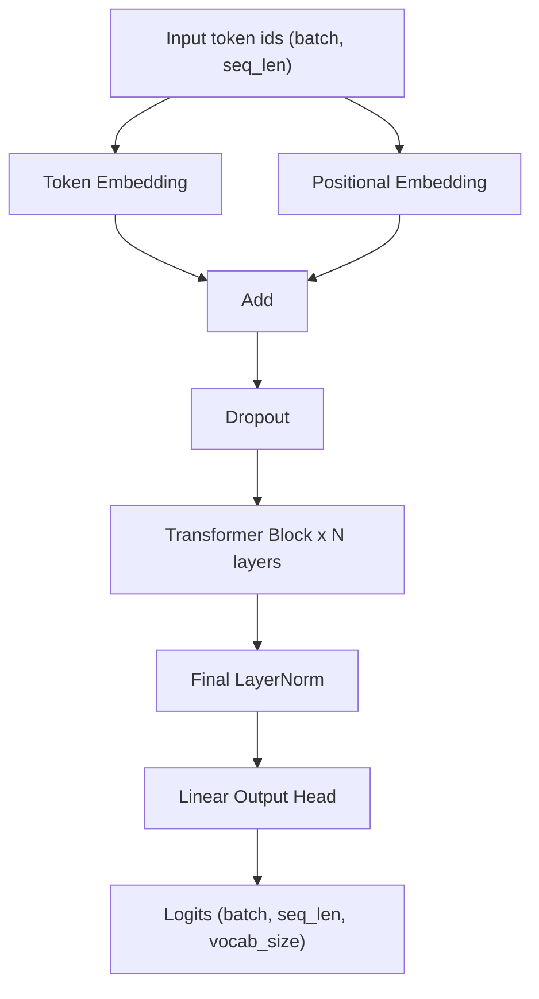
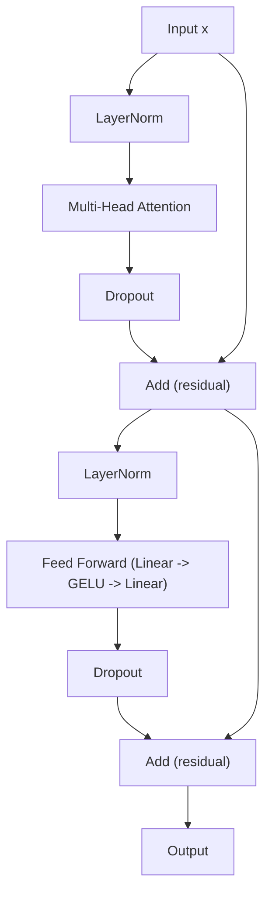
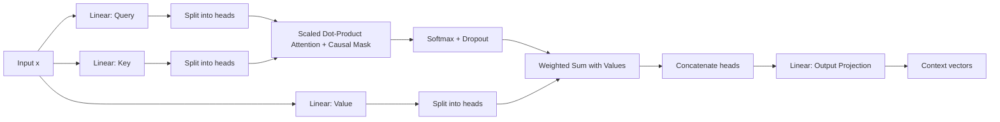
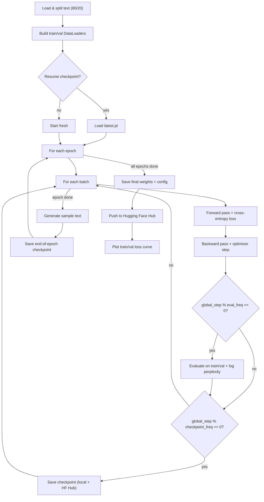

# GPT-2 From Scratch

A from-scratch PyTorch implementation of a GPT-2 style decoder-only transformer, including training, checkpointing, Hugging Face Hub sync, and text generation.

> **Note**: This version only uses a single GPU so if you have more than 1 GPU, this model only uses one of them.

## Features

- Custom `GPT_model` built from token/positional embeddings, stacked transformer blocks, layer norm, and an output head
- Multi-head causal self-attention implemented manually (no `nn.MultiheadAttention`)
- Configurable via `.env` (model size, training hyperparameters, tokenizer, paths)
- Streaming JSONL / plain-text dataset loading with a sliding-window `Dataset`
- Training loop with periodic evaluation, perplexity tracking, and loss plotting
- Resumable checkpoints, mirrored automatically to a Hugging Face Hub repo
- Greedy and temperature/top-k sampling for text generation
- Simple CLI (`-t` train, `-g` generate, `-i` info) plus an interactive fallback menu

## Architecture



### Transformer Block



### Multi-Head Attention



## Project Structure

```
.
├── main.py                     # CLI entry point (train / generate / info)
├── configs/
│   └── model_configs.py        # GPT_configs dataclass + .env loader
├── scripts/
│   └── evaluate.py             # Tokenization helpers + text generation
├── src/
│   ├── data/
│   │   └── dataset.py          # Dataset, DataLoader, text/JSONL loading
│   ├── models/
│   │   ├── gpt_model.py        # Top-level GPT_model
│   │   ├── transformer_block.py
│   │   ├── multi_head_attention.py
│   │   ├── feed_forward.py
│   │   ├── activations.py      # GELU
│   │   └── normalizers.py      # LayerNorm
│   ├── training/
│   │   ├── train.py            # Training loop, checkpoint resume, LR schedule
│   │   └── loss.py             # Cross-entropy loss + perplexity
│   └── utils/
│       ├── load_model.py       # Load local weights if present
│       ├── save_model_hf.py    # Push model + config to HF Hub
│       └── ckeckpoints.py      # Save/load training checkpoints (local + HF)
├── requirements.txt
└── .env                        # Runtime configuration (not committed with real secrets)
```

## Setup

```bash
pip install -r requirements.txt
```

Configure your run in `.env`:

```env
EPOCHS=30
BATCH_SIZE=2
VOCAB_SIZE=50257
CONTEXT_LENGTH=1024
EMB_DIM=768
N_HEADS=12
N_LAYERS=12
DROP_RATE=0.2
QKV_BIAS=True
TIKTOKEN_TOKENIZER=gpt2

DATA_PATH=./data/llm_dataset.jsonl
SAVE_MODEL_PATH=model-weights/
REPO_ID=your-username/your-repo

CHECKPOINT_FREQ=1000
CREAET_CHECKPOINTS=true
USE_CHECKPOINTS=true
CHECKPOINTS_PATH=check-points/
```

> Data can be a plain `.txt` file or a `.jsonl` file where each line has a `"text"` field.

If `REPO_ID` is a valid Hugging Face repo id, the app will prompt for login (or read `HF_TOKEN`) and automatically push weights, config, and checkpoints to the Hub.

## Usage

### Train

```bash
python main.py -t
```

Skips training and loads existing weights if `model-weights/pytorch_model.bin` is already present.

### Generate text

```bash
python main.py -g -p "Once upon a time"
```

Or omit `-p` to be prompted interactively.

### Inspect model & config

```bash
python main.py -i
```

### Interactive mode

Run with no flags for a `q` (quit) / `t` (train) / `g` (generate) / `i` (info) menu.

## Training Flow



## Sources

I used [Build a Large Language Model (From Scratch)](https://www.oreilly.com/library/view/build-a-large/9781633437166/) + [Attention Is All You Need](https://arxiv.org/pdf/1706.03762) + [Language Models are Unsupervised Multitask Learners](https://cdn.openai.com/better-language-models/language_models_are_unsupervised_multitask_learners.pdf) and the first part of [Hands-On Large Language Models: Language Understanding and Generation](https://www.oreilly.com/library/view/hands-on-large-language/9781098150952/) so I could understand deeply what is going on inside LLMs.

## License

For this repo we use MIT License so feel free to change it or help me to improve.
